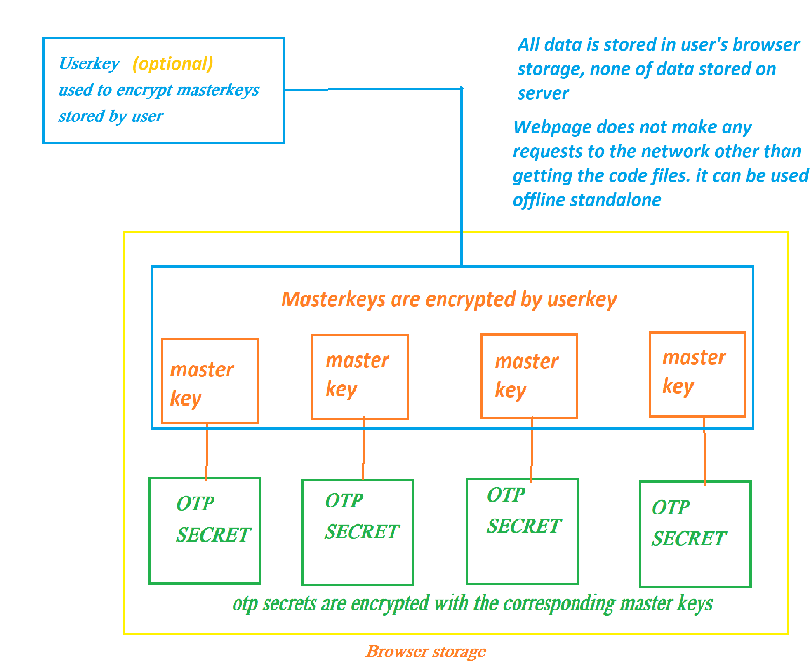

## Features

- Local-first storage (`localStorage`) with optional Service Worker offline mode.
- AES-GCM encryption for exported payloads and per-secret encryption.
- Base32 and QR code import support.
- Works entirely in-browser and via DevTools console.
- No google spyware/cloud sync
- No stupid specification limits like Aegis "Secret is not valid base32". All secrets are valid

## Quick Start (Browser Console)

```js
await generateOTP({
	issuer: "GitHub",
	secret: 'secret',
	digits: 6,
	period: 30,
	algorithm: "SHA1",
});
```
## Core Data Structures

- **settings** — runtime/UI settings.
- **config** — persistent config with `load()`, `save()`, `get()`, `set()`, `reset()`, `exportstr()`, `importstr()`.
- **keys** — list of key objects:

```ts
{
  id: string;
  order: number;
  accountName: string;
  encryptedKey: string;
  masterKeyHash: string;
  issuer?: string;
  digits?: 6 | 8;
  period?: number;
  algorithm?: "SHA1" | "SHA256" | "SHA512";
}
```

- **masterKeys** — list of master key objects:

```ts
{
  password: string;
  hash: string; // sha256(password)
}
```

## Key & Master Key API

- `await addMasterKey(masterKey)` — adds masterkey to `masterKeys` scope.
- `await addKey(accountName, keyValue, masterKey, options?)` — adds encrypted key.
- `await addKeyUI(accountName?, keyValue?, options?)` — interactive wrapper for adding keys.
- `deleteKey(keyObj)` — deletes key with confirmation.
- `getMatchingMasterKey(keyObj)` — returns matching master key.

## OTP Generation

- `await generateOTP(keyObj, offset = 0)` — compute TOTP/HOTP.  

## Import / Export

- `prepareKey(keyObj, options?)` — normalize key object.  
- `await exportData(toFile = false, shortImport = false)` — interactive export.  
- `await processExport(keysList, masterKeysList, password, shortImport = false)` — programmatic export.  
- `await importData(fromFile = false)` — interactive import.  
- `await processImport(input)` — programmatic import.

## QR / URI / Migration

- `startCameraScan()`, `startCamera()`, `stopCamera()` — camera control.  
- `handleFileSelection(event)`, `parseQRCode(image)`, `scanQRCode()` — QR decoding.  
- `addKeyFromQRText(qrText)` — parse `otpauth://` and migration URIs.  
- `parseOtpauthMigration(dataParam)` — parse migration payload.  

## Crypto & Encoding Helpers

- `encryptText(plainText, password)` / `decryptText(encryptedData, password)`  
- `deriveKey(password, salt)` / `sha256(message)`  
- Base32/Base64 conversion helpers (`base32ToUint8Array`, `base64ToArrayBuffer`, etc.)

## Security Notes

- Master keys reside in memory while session is active if masterkeys encryption not configured.  
- Secrets are encrypted per entry with a master key.  
- URL exports may expose encrypted payloads; disable if not desired.
